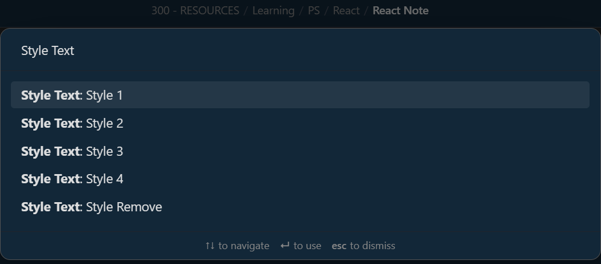
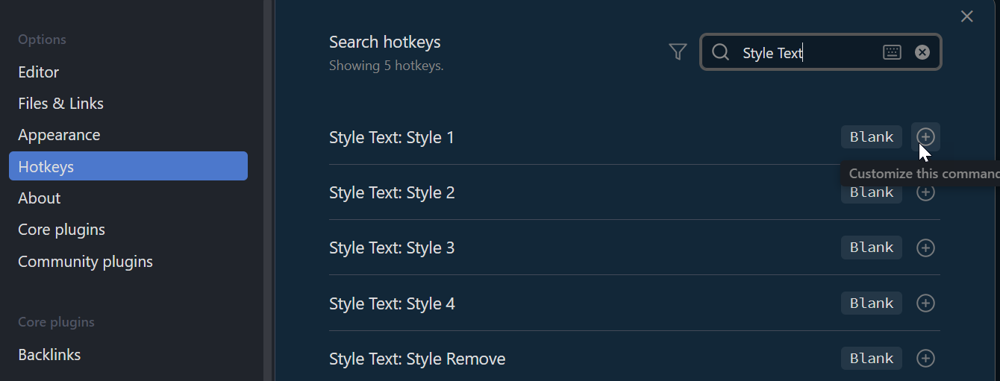
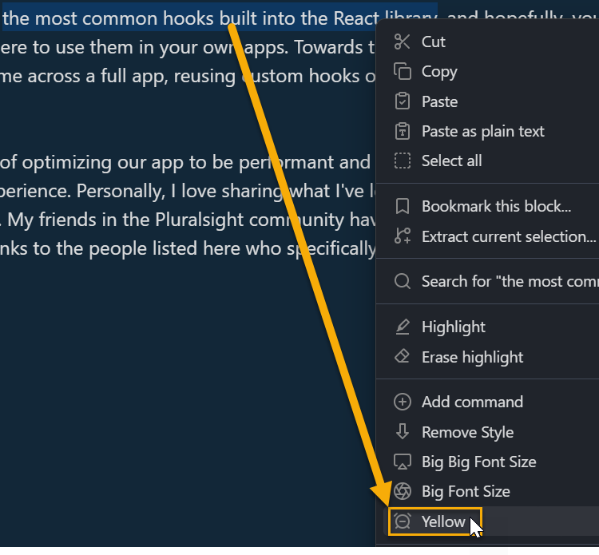
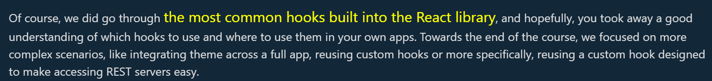
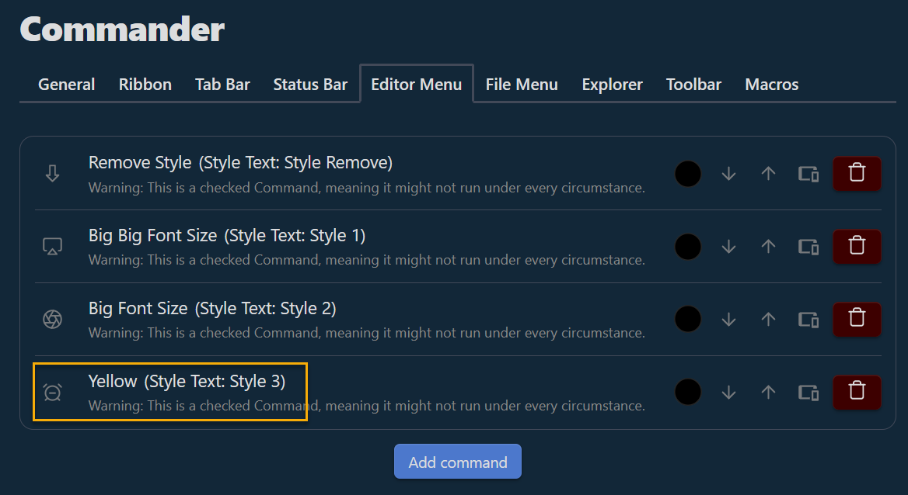

# Obsidian Style Text

Apply custom CSS styles to selected text in your Obsidian Notes.

## Instructions

This Obsidian plugin allows to create as many CSS Styles as you wish:

Then, they will be available to be applied to the selected text in the editor via **Commands** (Command Palette):

Each command can optionally be assigned to Obsidian Hotkeys for quick access:

Alternatively, you can use the [Obsidian Commander  Plugin](https://github.com/phibr0/obsidian-commander) to make them available via contextual menus when you right-click on the selected text:

That results with:

With the Commander configuration:

## Say Thank You

If you enjoy Style Text Obsidian Plugin then please support my work by buying me a coffee on [https://ko-fi.com/F1F6H4TAR](https://ko-fi.com/F1F6H4TAR)

